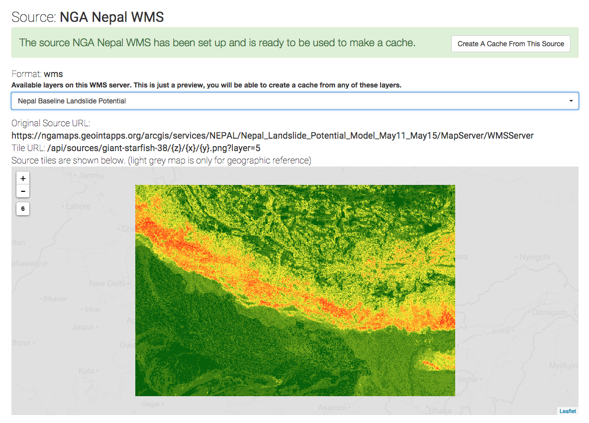

mapcache
============

03/30/2015

This is the MAGE client for Android devices.  Depends on the [MAGE Android SDK](http://github.com/).

## About

The Mobile Analytic GEOINT Environment, or MAGE, is a mobile situational awareness capability. The MAGE app on your mobile device allows you to create geotagged field reports–observations–that contain media such as photos, videos, and voice recordings and share them instantly with who you want. Using the GPS in your mobile device, MAGE can also track users locations in real time. Your locations can be automatically shared with the other members of your team.

If your mobile device loses its network connection, the app remains functional and will upload its local content when a connection is re-established. When disconnected from the network, MAGE will use local data layers to continue to provide relevant GEOINT.  Data layers, including map tiles and vector data, can stored on your mobile device and are available at all times.

MAGE is very customizable and can be tailored for you situation.

## How to Build

Make sure to download the and build the sdk first.

### Build

./gradlew clean

./gradlew assembleLocalDebug

### Install

./gradlew installLocalDebug

### Test

./gradlew connectedAndroidTestLocalDebug

## Contact

If you have any questions, or would like to get in touch, contact Ben Tuttle.

## License

Copyright 2015 BIT Systems

Licensed under the Apache License, Version 2.0 (the "License");
you may not use this file except in compliance with the License.
You may obtain a copy of the License at

    http://www.apache.org/licenses/LICENSE-2.0

Unless required by applicable law or agreed to in writing, software
distributed under the License is distributed on an "AS IS" BASIS,
WITHOUT WARRANTIES OR CONDITIONS OF ANY KIND, either express or implied.
See the License for the specific language governing permissions and
limitations under the License.